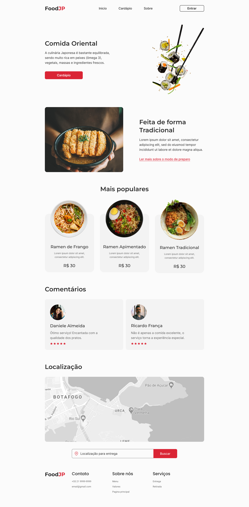
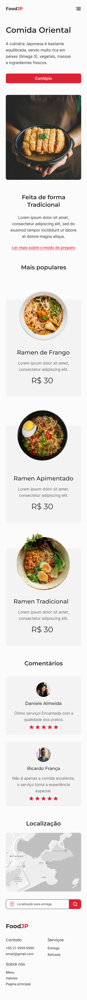

# Landing page FoodJP - em construção...

## ⌨ Descrição

Projeto realizado com o objetivo de reproduzir uma página de culinária oriental, usando as hard skills citadas abaixo. Desenvolvido em colaboração com dois colegas, onde podemos trabalhar gestão do projeto, gerenciamento de tempo e trabalho em equipe com setorial.

## ✍️ Tecnologias

- Marcação semântica HTML5
- Propriedades personalizadas de CSS3
- Flexbox
- Grid
- Design responsivo
- JavaScript

## ✍️ Layout

<html>

<table>
  <tr>
    <td class="center"></td>
    <td class="center"></td>
  </tr>
</table>

</html>

## 💡 Inspiração Figma

> Figma: <a href="https://www.figma.com/file/Yb9IBH56g7T1hdIyZ3BMNO/Desafios---Codel%C3%A2ndia?node-id=107523-1216&t=5FQIRJ6yv9EY25yy-0">Desafio-Codelândia Projeto FoodJP</a>

## Desenvolvedores

<html>

<table align="center">
  <tr>
    <td class="center-text">
      

         
          <b> Pablo Damato </b> 
            <a href="https://www.linkedin.com/in/pablo-damato-gomes/" alt="Linkedin"><a>
            
      

    </td>
    <td class="center-text">
      

         
          <b>Arthur Vinícius</b> 
            
            
      

    </td>
    <td class="center-text">
       

         
          <b>Leandro Santos</b> 
            
            
      

    </td>
  </tr>
</table>

</html>

